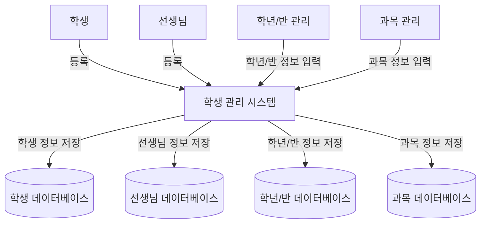

```mermaid
graph TD
    A[학생] -->|등록| B[학생 관리 시스템]
    B -->|학생 정보 저장| C[(학생 데이터베이스)]
    D[선생님] -->|등록| B
    B -->|선생님 정보 저장| E[(선생님 데이터베이스)]
    F[학년/반 관리] -->|학년/반 정보 입력| B
    B -->|학년/반 정보 저장| G[(학년/반 데이터베이스)]
    H[과목 관리] -->|과목 정보 입력| B
    B -->|과목 정보 저장| I[(과목 데이터베이스)]
```    